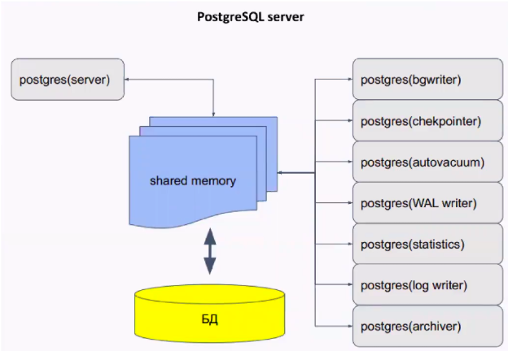

# Vagrant-стенд c Postgres


### Цель домашнего задания
Научиться настраивать репликацию и создавать резервные копии в СУБД PostgreSQL     

### Описание домашнего задания
1) Настроить hot_standby репликацию с использованием слотов    
2) Настроить правильное резервное копирование     
     
    
Формат сдачи ДЗ - vagrant + ansible      

### Введение     
PostgreSQL — свободная объектно-реляционная система управления базами данных (СУБД).     
Основные термины в Postgres:    
Кластер - объединение нескольких баз данных. В postgres это означает что на одном хосте создаётся несколько баз сразу.      
База данных - физическое объединение объектов     
Схема - логическое объединение таблиц в базе данных. По умолчанию в postgres создается одна схема под названием Public     
По умолчанию в кластере находятся:     
- template0 - read only БД, содержащая инициализационный набор данных     
- template1 - база-шаблон для создания новых баз     
- postgres (при желании можно поменять название). В базе находятся служебные таблицы, можно также использовать данную базу для своих нужд, но это не рекомендуется.     

Управлять базами, таблицами и данными можно не только с помощью консольной утилиты psql, но и с помощью GUI-утилит, например pgAdmin, Dbeaver  и т. д.     

Postgres - это мультипроцессное приложение. Состоит из главного процесса (postgres), который отвечает за подключение клиентов, взаимодействие с кэшом и отвечает за остальные процессы (background processes).    

     

Основные конфигурационные файлы в Postgres:      
pg_hba.conf -  файл задает способ доступа к базам и репликации из различных источников.     
postgresql.conf - файл конфигурации, обычно находится в каталоге данных, может редактироваться вручную. Может быть несколько значений одного и того же параметра, тогда вступает в силу последнее значение.      
postgresql.auto.conf - предназначен для автоматического изменения параметров postgres      

WAL (Write Ahead Log) - журнал упреждающей записи     
В WAL записывается информация, достаточная для повторного выполнения всех действий с БД.      
Записи этого журнала обязаны попасть на диск раньше, чем изменения в соответствующей странице. Журнал состоит из нескольких файлов (обычно по 16МБ), которые циклически перезаписываются.      

Репликация - процесс синхронизации нескольких копий одного объекта. Решает задачу отказоустойчивости и масштабируемости.     

Задачи репликации:     
балансировка нагрузки     
резервирование (НЕ БЭКАП, бэкап можно делать с реплики)     
обновление без остановки системы     
горизонтальное масштабирование     
геораспределение нагрузки     

Виды репликации:     
Физическая репликация - описание изменений на уровне файлов. Побайтовая копия данных.      
Логическая репликация - изменения данных в терминах строк таблиц. Более высокий уровень, чем файлы      

Помимо репликации, рекомендуется создавать резервные копии. Они могут потребоваться, если вдруг сервера СУБД выйдут из строя.      

## Выполнение    
### 1.  С помощью vagrant развернул машины:    

| Имя          | IP-адрес       |  OS   |
|-------------|---------------|-----------|
| node1  | 192.168.57.11  |  ubuntu/jammy64  |  
| node2  | 192.168.57.12  |  ubuntu/jammy64  |
| barman  | 192.168.57.13  |  ubuntu/jammy64  |


### 2. Создал ansible playbook и роли для устоновки необходимого софта и настройки репликации    
Запустил playbook    
```shell
root@ansible:/home/vagrant/ansible# ansible-playbook postgres.yml

PLAY [Configure PostgreSQL replication] ***********************************************************************

TASK [Gathering Facts] ****************************************************************************************
ok: [node2]
ok: [node1]
...
TASK [replication : Print result] *****************************************************************************
ok: [node1] => {
    "result.stdout_lines": [
        "                              List of databases",
        "   Name    |  Owner   | Encoding | Collate |  Ctype  |   Access privileges   ",
        "-----------+----------+----------+---------+---------+-----------------------",
        " otus      | postgres | UTF8     | C.UTF-8 | C.UTF-8 | ",
        " postgres  | postgres | UTF8     | C.UTF-8 | C.UTF-8 | ",
        " template0 | postgres | UTF8     | C.UTF-8 | C.UTF-8 | =c/postgres          +",
        "           |          |          |         |         | postgres=CTc/postgres",
        " template1 | postgres | UTF8     | C.UTF-8 | C.UTF-8 | =c/postgres          +",
        "           |          |          |         |         | postgres=CTc/postgres",
        "(4 rows)"
    ]
}
ok: [node2] => {
    "result.stdout_lines": [
        "                              List of databases",
        "   Name    |  Owner   | Encoding | Collate |  Ctype  |   Access privileges   ",
        "-----------+----------+----------+---------+---------+-----------------------",
        " otus      | postgres | UTF8     | C.UTF-8 | C.UTF-8 | ",
        " postgres  | postgres | UTF8     | C.UTF-8 | C.UTF-8 | ",
        " template0 | postgres | UTF8     | C.UTF-8 | C.UTF-8 | =c/postgres          +",
        "           |          |          |         |         | postgres=CTc/postgres",
        " template1 | postgres | UTF8     | C.UTF-8 | C.UTF-8 | =c/postgres          +",
        "           |          |          |         |         | postgres=CTc/postgres",
        "(4 rows)"
    ]
}

PLAY RECAP ****************************************************************************************************
node1                      : ok=13   changed=10   unreachable=0    failed=0    skipped=5    rescued=0    ignored=0
node2                      : ok=16   changed=13   unreachable=0    failed=0    skipped=2    rescued=0    ignored=0
```   
Playbook отработал без ошибок    
Из вывода задачи replication : Print result, вижу что репликация работает. Создаваемая на мастере база Otus в задачах ansible, пролилась на слейв     

### 3. Далее запустил playbook настройки backup с помощью pg_basebackup     
**выполнение 2 условия ДЗ решил сделать с помощью pg_basebackup, решение было принято после многократных неудачных попыток сделать это с помощью утилиты barman (сервер бэкапа поэтому так и называется), мне не удалось выполнить условие таким решением**     
```shell
root@ansible:/home/vagrant/ansible# ansible-playbook backup.yml

PLAY [Configure backup] ***************************************************************************************

TASK [Gathering Facts] ****************************************************************************************
ok: [barman]
ok: [node1]
...
PLAY RECAP ****************************************************************************************************
barman                     : ok=8    changed=7    unreachable=0    failed=0    skipped=4    rescued=0    ignored=0
node1                      : ok=9    changed=6    unreachable=0    failed=0    skipped=4    rescued=0    ignored=0
```    
Playbook отработал без ошибок    

### 3.1. Пробую выполнить создание тестовой базы, с последующим бэкапом баз    

```shell
root@ansible:/home/vagrant/ansible# ansible-playbook createdb_backup.yml

PLAY [PostgreSQL Backup & Restore with Test Data] *************************************************************

TASK [Gathering Facts] ****************************************************************************************
ok: [node1]
ok: [barman]
ok: [node2]
...
TASK [Show backup result] *************************************************************************************
skipping: [node1]
skipping: [node2]
ok: [barman] => {
    "msg": {
        "changed": true,
        "cmd": [
            "pg_basebackup",
            "-h",
            "192.168.57.11",
            "-p",
            "5432",
            "-U",
            "backup_user",
            "-D",
            "/var/lib/postgresql/backups/pg_backup_2025-03-26",
            "-Ft",
            "-z",
            "-Xs",
            "-P",
            "-v"
        ],
        "delta": "0:00:08.877679",
        "end": "2025-03-26 14:02:00.437284",
        "failed": false,
        "rc": 0,
        "start": "2025-03-26 14:01:51.559605",
        "stderr": "pg_basebackup: initiating base backup, waiting for checkpoint to complete\npg_basebackup: checkpoint completed\npg_basebackup: write-ahead log start point: 0/8000028 on timeline 1\npg_basebackup: starting background WAL receiver\npg_basebackup: created temporary replication slot \"pg_basebackup_6676\"\n    0/43460 kB (0%), 0/1 tablespace (...pg_backup_2025-03-26/base.tar.gz)\n11064/43460 kB (25%), 0/1 tablespace (...pg_backup_2025-03-26/base.tar.gz)\n30163/43460 kB (69%), 0/1 tablespace (...pg_backup_2025-03-26/base.tar.gz)\n43470/43470 kB (100%), 0/1 tablespace (...pg_backup_2025-03-26/base.tar.gz)\n43470/43470 kB (100%), 1/1 tablespace                                         \npg_basebackup: write-ahead log end point: 0/8000100\npg_basebackup: waiting for background process to finish streaming ...\npg_basebackup: syncing data to disk ...\npg_basebackup: renaming backup_manifest.tmp to backup_manifest\npg_basebackup: base backup completed",
        "stderr_lines": [
            "pg_basebackup: initiating base backup, waiting for checkpoint to complete",
            "pg_basebackup: checkpoint completed",
            "pg_basebackup: write-ahead log start point: 0/8000028 on timeline 1",
            "pg_basebackup: starting background WAL receiver",
            "pg_basebackup: created temporary replication slot \"pg_basebackup_6676\"",
            "    0/43460 kB (0%), 0/1 tablespace (...pg_backup_2025-03-26/base.tar.gz)",
            "11064/43460 kB (25%), 0/1 tablespace (...pg_backup_2025-03-26/base.tar.gz)",
            "30163/43460 kB (69%), 0/1 tablespace (...pg_backup_2025-03-26/base.tar.gz)",
            "43470/43470 kB (100%), 0/1 tablespace (...pg_backup_2025-03-26/base.tar.gz)",
            "43470/43470 kB (100%), 1/1 tablespace                                         ",
            "pg_basebackup: write-ahead log end point: 0/8000100",
            "pg_basebackup: waiting for background process to finish streaming ...",
            "pg_basebackup: syncing data to disk ...",
            "pg_basebackup: renaming backup_manifest.tmp to backup_manifest",
            "pg_basebackup: base backup completed"
        ],
        "stdout": "",
        "stdout_lines": []
    }
}

TASK [List backup directory to check for the backup file] *****************************************************
skipping: [node1]
skipping: [node2]
changed: [barman]

TASK [Show backup directory contents] *************************************************************************
skipping: [node1]
skipping: [node2]
ok: [barman] => {
    "msg": "total 5732\n-rw------- 1 root root  223343 Mar 26 14:01 backup_manifest\n-rw------- 1 root root 5621804 Mar 26 14:01 base.tar.gz\n-rw------- 1 root root   17071 Mar 26 14:02 pg_wal.tar.gz"
}

PLAY RECAP ****************************************************************************************************
barman                     : ok=6    changed=2    unreachable=0    failed=0    skipped=3    rescued=0    ignored=0
node1                      : ok=4    changed=3    unreachable=0    failed=0    skipped=5    rescued=0    ignored=0
node2                      : ok=1    changed=0    unreachable=0    failed=0    skipped=8    rescued=0    ignored=0
```    
Playbook отработал без ошибок    
Из вывода задачи TASK [Show backup result], вижу что бэкап создан успешно.    

____________________________________________________________________     
end


